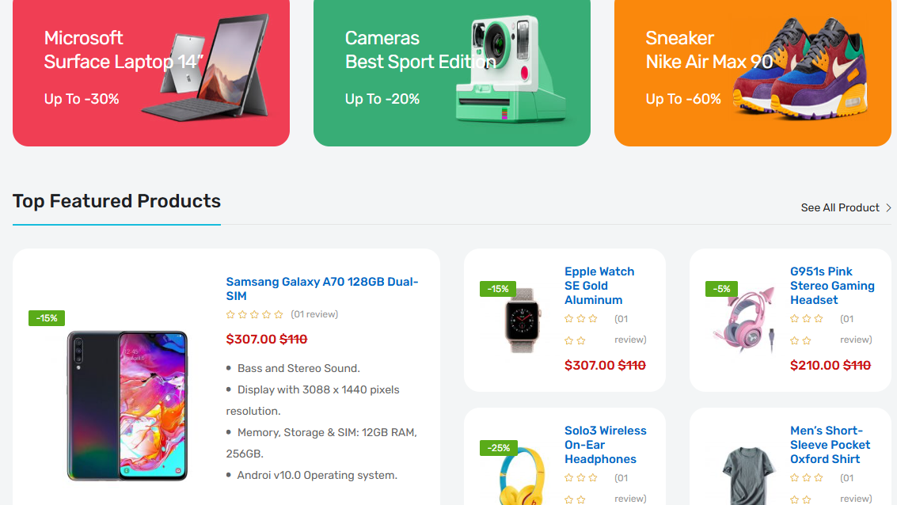
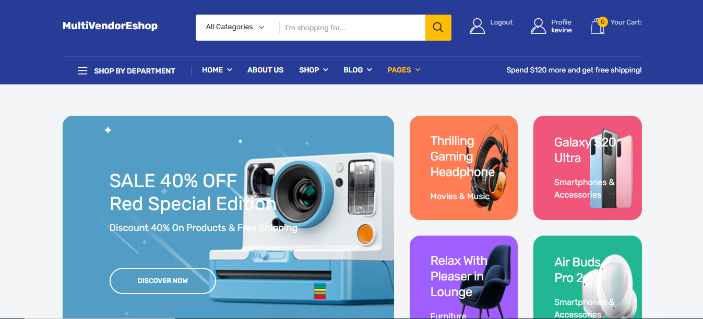

# Multi Vendor Ecommerce Project

Welcome to our Multi Vendor Ecommerce project! This repository contains a powerful platform built on Django that enables multiple user roles and facilitates a seamless shopping experience.

## Features
### User Roles
1. Super User: This role controls the entire site and has access to a separate admin dashboard.
2. Employee User: Assigned by the Super User, employees manage placed and completed orders through their dedicated dashboard.
3. Vendor User: Anyone can register as a vendor, gaining access to their dashboard where they can create a store, add products, and manage their shop.
4. Normal User or Customer: These users can browse products, add them to their cart, and make purchases after registering on the site.

### Products
Vendors' added products are displayed on the home page. Customers can easily add items to their cart, adjust quantities, proceed to the checkout page, add shipping details, and make payments.

### Product Review
Users can provide feedback on products using a star rating system. Reviews are displayed alongside the product, showcasing the average review count.

### Payments
The ecommerce platform is integrated with Stripe payments, allowing customers to conveniently pay with cards, ensuring secure and swift transactions.

### Usage
To utilize this project:

- Clone the Repository: https://github.com/Sengwamana/-Bazaaro-A-Vendor-Driven-eCommerce-System.git
- Installation: Install the required dependencies. Set up the database and migrations.
- Configuration: Configure settings such as Stripe API keys, site settings, and email configurations.
- Run the Server: Launch the Django server to explore the functionalities.
- Register and Explore: Register as different user roles to experience the distinct dashboards and functionalities. Test the shopping flow, add products, leave reviews, and make payments.

### screenshooot
the main homepage

### second screenshot
what it shows is the project ui interface

